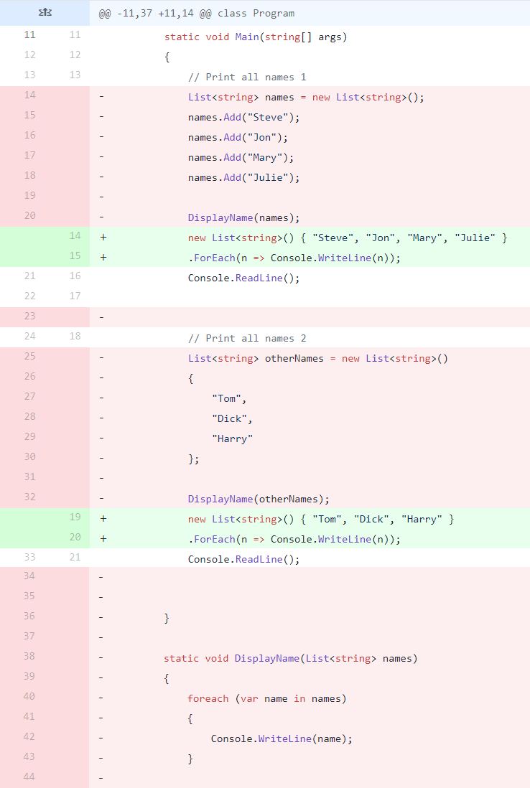

# For_Each

This repository contains simple C# code that demonstrates the power and clarity of functional programming and the ForEach method. Rather than needing a new function that may be ambiguous in its effect and hoping to communicate its effect through its name, we can use the ForEach method to clearly show what is happening.

I learned about the ForEach loop through https://www.youtube.com/watch?v=s8ru33IIQzc. Thank you for the learning experience.
